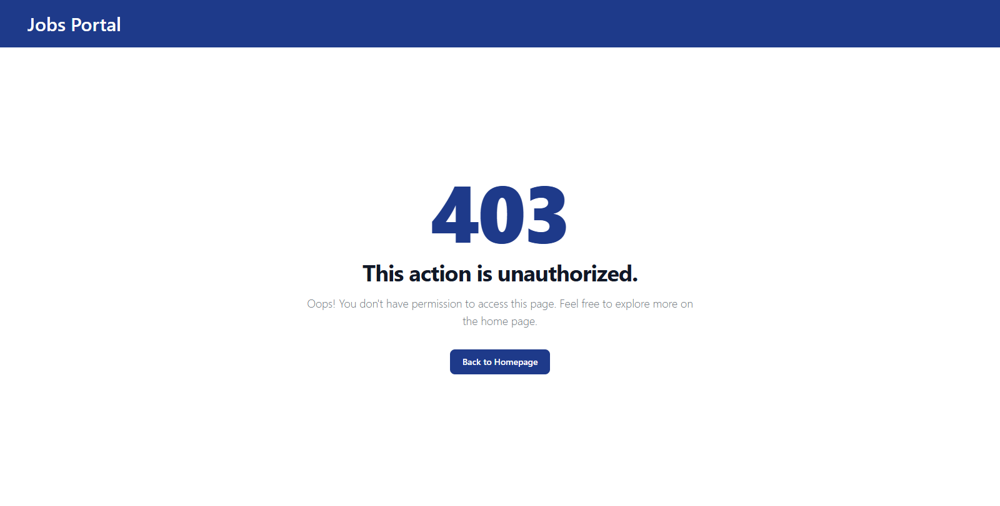
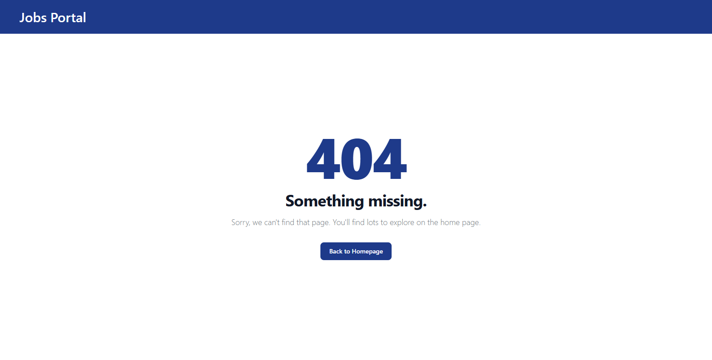

# Jobs Portal

This App Created Using Laravel 11 with TailwindCss

```
laravel new jobs-portal
```


## Screenshots

### Home Page (Desktop)


### Jobs Page (Desktop)


### Jobs Page (No Job) (Desktop)


### Job Details Page (Desktop)


### Create Job Page (Desktop)


### Errors Pages


<!-- <p align="center">
    
    
</p> -->

<div align="center">
    <div style="display: inline-block; text-align: center; margin: 0 10px;">
        <p><strong>403 - Forbidden</strong></p>
        
    </div>
    <div style="display: inline-block; text-align: center; margin: 0 10px;">
        <p><strong>404 - Not Found</strong></p>
        
    </div>
</div>
